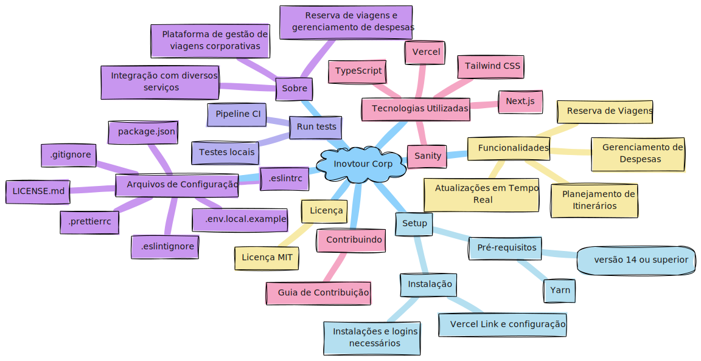

<p align="center">

</p>
<h1 align="center">
Inovtour Corp
</h1>
<p align="center">
Plataforma de gestão de viagens corporativas.
</p>

<p align="center">
<a href="https://inovtour-corp.vercel.app/"><b>Live Demo!</b></a>
</p>
<p align="center">
 <a href="https://inovtour-corp.docs">📖 Documentação</a> | <a href="https://inovtour-corp.docs/intro/">🚀 Primeiros Passos</a> | <a href="https://www.jsdelivr.com/package/npm/inovtour-corp">🌐 CDN</a> | <a href="https://discord.gg/AgrbSrBer3" title="Discord invite">🙌 Junte-se a Nós</a>
</p>
<p align="center">
<a href="./README.pt-BR.md">Português (BR)</a>
</p>
<p align="center">
Experimente as pré-visualizações do editor ao vivo das próximas versões: <a href="https://develop.inovtour-corp.live/" title="Experimente a versão da branch develop da inovtour-corp.">Develop</a> | <a href="https://next.inovtour-corp.live/" title="Experimente a versão da branch next da inovtour-corp.">Next</a>
</p>

<br>
<br>

[](https://www.npmjs.com/package/inovtour-corp)
[](https://bundlephobia.com/package/inovtour-corp)
[](https://app.codecov.io/github/govinda777/inovtour-corp/tree/develop)
[](https://www.jsdelivr.com/package/npm/inovtour-corp)
[](https://www.npmjs.com/package/inovtour-corp)
[](https://discord.gg/AgrbSrBer3)
[](https://twitter.com/inovtour_)


:trophy: **Inovtour Corp venceu o [Corporate Travel Awards (2023)](https://awards.com/corporate-travel/2023) na categoria "Melhor Plataforma de Gestão de Viagens"!!!**



**Obrigado a todos os envolvidos, pessoas que fizeram pull requests, que responderam perguntas! 🙏**

## Índice

<details>
<summary>Expandir conteúdos</summary>

- [Sobre](#sobre)
- [Setup](#setup)
- [Run tests](#run-tests)
- [Uso](#uso)
- [Contribuindo](#contribuindo)
- [Licença](#licença)

</details>

## Sobre

Inovtour Corp é uma plataforma de gestão de viagens projetada para agências de viagens corporativas. Ela simplifica a reserva de viagens, o gerenciamento de despesas e o planejamento de itinerários, tornando as viagens corporativas eficientes e sem complicações.

> Gerenciamento eficiente de viagens economiza tempo e recursos.

Com a Inovtour Corp, você pode gerenciar reservas de viagens, monitorar despesas de viagens e proporcionar experiências de viagem sem interrupções aos seus clientes. A plataforma integra diversos serviços para oferecer uma solução completa para todas as necessidades de viagens corporativas.

## Tecnologias Utilizadas

- **Next.js**: Framework React para aplicações web.
- **Sanity**: Plataforma de gerenciamento de conteúdo.
- **Tailwind CSS**: Framework de CSS utilitário.
- **TypeScript**: Superset de JavaScript para tipagem estática.
- **Vercel**: Plataforma de deploy e hospedagem.

## Setup

### Pré-requisitos

- Node.js (versão 14 ou superior)
- Yarn

### Instalação

1. Vincule o projeto com Vercel:

```bash
npx vercel link
```

2. Puxe as variáveis de ambiente para o seu sistema local:

```bash
npx vercel env pull
```

3. Instale as dependências:

```bash
yarn install --registry https://registry.npmjs.org
```

4. Configure o Sanity:

```bash
npm install -g @sanity/cli
```

5. Faça login no Sanity:

```bash
sanity login
```

6. Importe o conteúdo de demonstração:

```bash
npm run sanity-import
```

7. Execute o projeto:

```bash
yarn dev
```

8. Execute o CMS Sanity:

```bash
npm run sanity
```

9. Faça o deploy para o Vercel:

```bash
npx vercel --prod
```

## Run tests

### Localmente

1. Instale o Act para simular a pipeline do GitHub Actions localmente:

```bash
brew install act
```

2. Execute os testes E2E:

```bash
yarn test:e2e
```

### Pipeline CI

A pipeline CI utiliza GitHub Actions para construir e executar testes E2E automaticamente em cada push para a branch `main` ou ao abrir um pull request.

### Comando para rodar a pipeline localmente

Caso deseje rodar a pipeline localmente com Act:

```bash
yarn act
```

## Uso

### Funcionalidades

* **Reserva de Viagens**: Reserve voos, hotéis e aluguel de carros.
* **Gerenciamento de Despesas**: Acompanhe e gerencie despesas de viagens.
* **Planejamento de Itinerários**: Crie e compartilhe itinerários de viagens detalhados.
* **Atualizações em Tempo Real**: Receba atualizações sobre status de voos, reservas de hotéis e mais.

### Integrações

A Inovtour Corp se integra com vários serviços de terceiros para fornecer uma experiência contínua. Confira a página de Integrações para mais detalhes.

## Arquivos de Configuração

Os arquivos de configuração são essenciais para definir o comportamento e a integração da aplicação. Aqui estão os principais arquivos de configuração no projeto Inovtour-Corp e o que você pode fazer com eles:

- **`.env.local.example`**: Exemplo de variáveis de ambiente.
- **`.eslintignore`**: Arquivos e diretórios a serem ignorados pelo ESLint.
- **`.eslintrc`**: Configurações do ESLint.
- **`.gitignore`**: Arquivos e diretórios a serem ignorados pelo Git.
- **`.prettierrc`**: Configurações do Prettier.
- **`LICENSE.md`**: Licença do projeto.
- **`README.md`**: Documentação do projeto.
- **`next-sitemap.config.js`**: Configurações do sitemap.
- **`next.config.js`**: Configurações do Next.js.
- **`package.json`**: Dependências e scripts do projeto.
- **`pnpm-lock.yaml`**: Lockfile do pnpm.
- **`postcss.config.js`**: Configurações do PostCSS.
- **`sanity.cli.ts`**: Configurações do CLI do Sanity.
- **`sanity.config.ts`**: Configurações do Sanity.
- **`tailwind.config.js`**: Configurações do Tailwind CSS.
- **`tsconfig.json`**: Configurações do TypeScript.
- **`yarn.lock`**: Lockfile do Yarn.

## Links

- [Live Demo](https://inovtour-corp.vercel.app/)
- [Documentação](https://inovtour-corp.docs)
- [Figma Site](https://www.figma.com/design/pjuPkngqXmwDqPl5W3UU1y/Inovtour?node-id=94-434&t=gm8OsOSOTa1JeJKn-1)
- [Figma Estudo](https://www.figma.com/file/eQNyCKBenlZYG1sXA03t5n/Inovtour---desk-research?type=whiteboard&node-id=0%3A1&t=HJ4fZZLiCpHuahNk-1)
- [Blue Ocean](https://docs.google.com/spreadsheets/d/1IE6fQinP2gdQYV3Ib0WicAfLGkd9JVj7Hq_TwJNW3BM/edit?

usp=sharing)
- [Miro](https://miro.com/app/board/uXjVKRVfwCk=/)

## Contribuindo

Agradecemos contribuições da comunidade. Para começar, confira nosso Guia de Contribuição.

## Licença

Este projeto está licenciado sob a Licença MIT. Veja o arquivo LICENSE para mais detalhes.